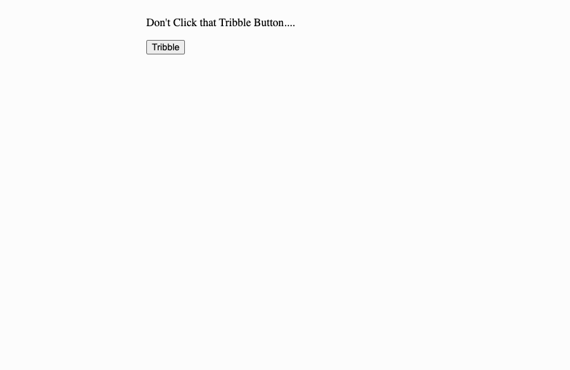
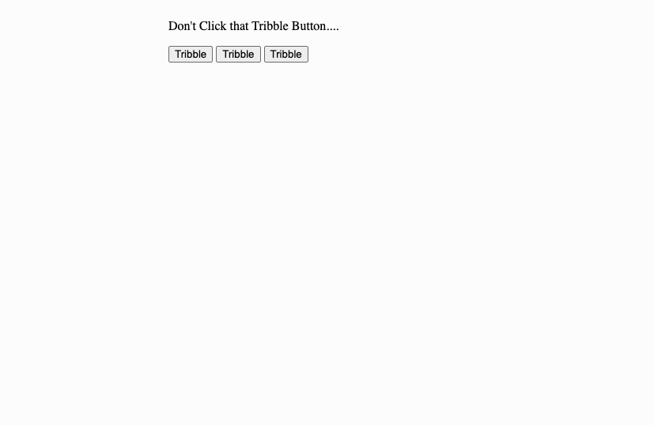
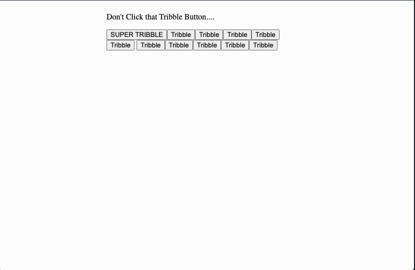
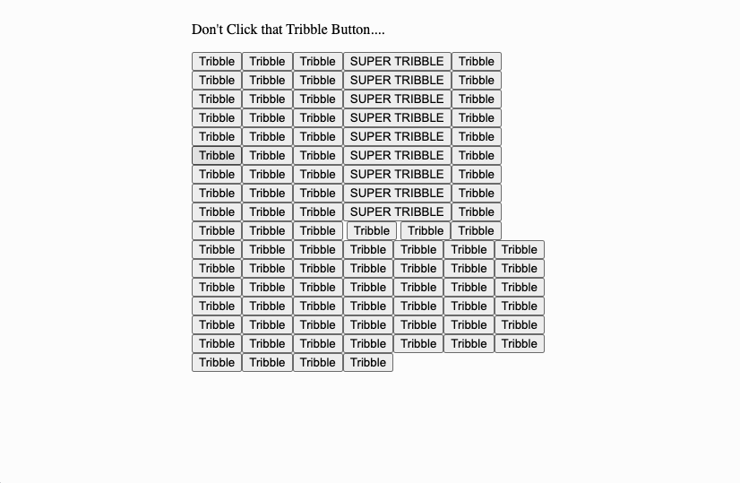

# Welcome to ACME Tech Enterprises
We will first make an app where we will make buttons appear using vanilla JS.

##We have two parts to this interview:
- Vanilla Dom manipulation
- Frontend Questions

### Vanilla Dom Manipulation:

<strong><em>I want you to make the html look like this:</em></strong>

<strong><em>When you click the button it should look like this (add two more buttons):</em></strong>

<strong><em>If you continue to click any button the behavior should be the same as before (adding two more tribble buttons):</em></strong>
 
<strong>*Additionally,<em> For every 5th click (on any button) there will be a 'Super Tribble' button that will appear in the group along with a 'normal tribble button'.</em></strong>

<strong><em>The buttons should be contained in the center of the page, and should not grow to be a width more than 400px.</em></strong>

<strong><em>**If there is time, I want ALL super tribble button(s) to have a shake animation for 2 seconds when any super tribble buttons are created.</em></strong>

